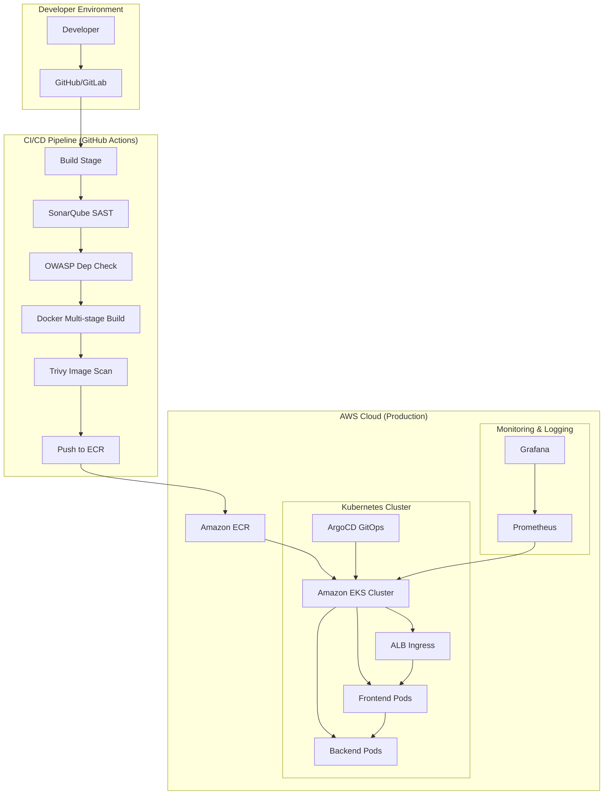

# Production-Grade DevOps & DevSecOps for 3-Tier E-Commerce

This repository contains the complete infrastructure, containerization, and CI/CD configuration for a production-ready 3-tier e-commerce application.

## 🏗️ Architecture Overview



The application follows a modern cloud-native architecture:
- **Frontend**: React SPA served via Nginx.
- **Backend**: Node.js REST API.
- **Database**: PostgreSQL (Managed via AWS RDS or K8s StatefulSet).
- **Infrastructure**: AWS EKS (Kubernetes) provisioned via Terraform.
- **CI/CD**: GitHub Actions with integrated security scanning.
- **GitOps**: ArgoCD for continuous deployment.
- **Monitoring**: Prometheus & Grafana.

### 🔄 Data Flow
`Developer -> Git -> CI/CD (SonarQube/OWASP/Trivy) -> Docker -> ECR -> EKS (ArgoCD) -> Monitoring (Prometheus/Grafana)`

## 📁 Folder Structure
- `devops/docker/`: Optimized multi-stage Dockerfiles.
- `devops/terraform/`: IaC for AWS VPC, EKS, and ECR.
- `devops/k8s/`: Kubernetes manifests (Deployment, Service, Ingress, etc.).
- `devops/cicd/`: GitHub Actions pipeline configuration.
- `devops/argocd/`: GitOps application definition.
- `devops/monitoring/`: Prometheus and Grafana configurations.
- `devops/docs/`: Detailed documentation for each component.

## 🚀 Quick Start

1. **Infrastructure**:
   ```bash
   cd devops/terraform
   terraform init
   terraform apply
   ```

2. **CI/CD**:
   - Configure secrets in GitHub (AWS_ACCESS_KEY, SONAR_TOKEN, etc.).
   - Push to `main` to trigger the pipeline.

3. **GitOps**:
   - Install ArgoCD on EKS.
   - Apply `devops/argocd/application.yaml`.

4. **Monitoring**:
   - Install Prometheus and Grafana using Helm with provided values.

## 🛡️ DevSecOps Integration
- **Static Analysis**: SonarQube for code quality.
- **Dependency Scan**: OWASP Dependency Check for vulnerable libraries.
- **Image Scan**: Trivy for container vulnerabilities.
- **Least Privilege**: IAM roles for EKS service accounts.
- **Secret Management**: K8s Secrets (integrated with AWS Secrets Manager in real production).

---
*Generated by Senior DevOps & DevSecOps Engineer*
